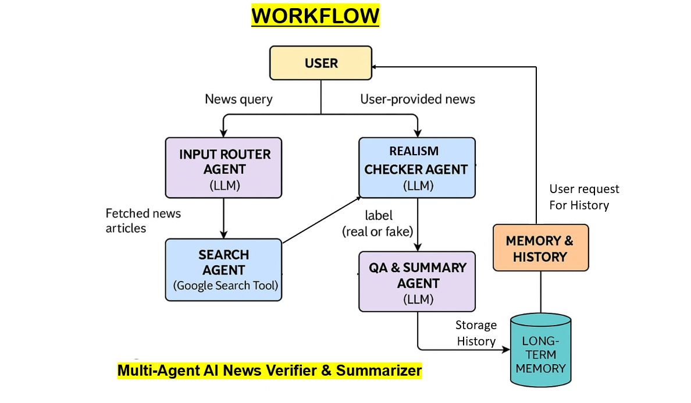
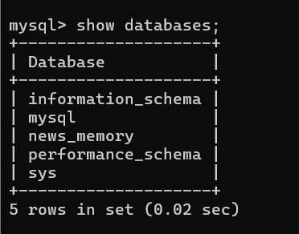

# **📰 Agentic AI News Verifier & Summarizer**

### *Trusted News Agent: A Multi-Agent AI System for Real-Time News Verification and Summarization*


---

## 🚀 **1. Overview**

Misinformation spreads faster than facts. People often struggle to identify whether a piece of news is **real, fake, misleading, or manipulated**. Manual verification requires time, expertise, and cross-checking multiple sources — something most users cannot do quickly.

This project solves that challenge by building an **Agentic AI system** that automatically verifies news credibility, summarizes content, checks external evidence using tools, and stores user-specific news history through memory.

This project is created as part of the **5-Day AI Agents Intensive Course with Kaggle and Google for Capstone Project Hackathon**,  applying the concepts taught across all five units: multi-agent systems, tools & MCP, sessions & memory, observability, A2A protocol, and prototype-to-production patterns.

---

## 🎯 **2. Problem Statement**

Online news consumption is chaotic:

* Fake news spreads rapidly
* Users have no quick way to fact-check articles
* Evidence evaluation is time-intensive
* Long articles are difficult to digest
* Users get no personalized insights or history-based recommendations

There is a need for a **reliable, fast, automated verification system** that can detect misinformation *and* simplify news consumption.

---

## 💡 **3. Solution: Agentic AI News Verifier & Summarizer**

A full-stack, end-to-end Agentic AI system that:

### 🔍 **Verifies**

Uses multi-agents to evaluate authenticity, credibility score, bias, and cross-references factual data according to this mark as Real, Uncertain or fake.

### 📑 **Summarizes**

Creates short, readable, verified summaries using LLMs.

### 🌐 **Searches in Real-Time**

Uses **Google Search tool** to gather supporting evidence.

### 🧠 **Learns User Preferences**

Stores user-specific news memory (Stores all searches).

### 🪪 **Uses Agentic Architecture**

A structured, multi-agent workflow for accuracy and reliability.

The system includes a **FastAPI backend**, a **MySQL database**, and a **modern HTML/CSS/JS frontend**.

---

## 🤖 **4. Agent Architecture**



### **Multi-Agent System Used**

| Agent                                  | Responsibility                                      |
| -------------------------------------- | --------------------------------------------------- |
| **Input Router Agent**                 | Extracts content, cleans text, prepares input       |
| **Realism Checker Agent**              | Checks credibility, bias, misinformation patterns   |
| **Search Agent (Tool Agent)**          | Uses Google Search tool to find supporting evidence |
| **QA & Summary Agent**                 | Converts long content into short verified summaries |
| **Memory Agent**                       | Stores/retrieves long-term user news interactions   |

---

## 🛠️ **5. Workflow**

Below is the **complete end-to-end workflow** of the *Agentic AI News Verifier & Summarizer*:

### **Step 1: User Inputs News URL or Text**

* User pastes a news link or article
* Frontend sends request to backend API

### **Step 2: Coordinator Agent Triggers Pipeline**

* Initiates multi-agent sequence
* Shares initial context across agents (session)

### **Step 3: Input Router Agent Extracts & Cleans Data**

* Fetches article content
* Performs text cleaning, formatting, metadata extraction

### **Step 4: Realism Checker Agent Analyzes Credibility**

* Checks factual consistency
* Detects bias, sentiment, manipulation patterns
* Generates initial credibility score

### **Step 5: Search Agent Uses Google Search Tool**

* Searches the web for supporting or contradicting evidence
* Extracts findings
* Sends results back to Verification Agent
  *(May use long-running operation if external search takes time or your Internet speed is slow, but it generally always take 3-4 seconds only - FAST)*

### **Step 6: Realism Checker Agent Updates Final Score**

* Refines credibility score
* Adds evidence-based reasoning
* Produces final verification summary

### **Step 7: QA & Summary Agent Creates Verified Summary**

* Produces short, concise, fact-checked summary
* Ensures neutral tone

### **Step 8: Memory Agent Stores User-Specific History**

* Saves:

  * article title
  * verification result
  * summary
  * timestamp
  * user preferences
* Enables personalization over time

### **Step 9: Observability Layer Logs Everything**

* Logs agent decisions
* Traces agent-to-agent interactions
* Captures metrics for debugging & evaluation

### **Step 10: Frontend Displays Final Output**

* Verified score
* Fact-checked summary
* Evidence sources
* User history insights

---

## 🧩 **6. Key Agentic Concepts Implemented**

### ✔️ **Multi-Agent System**

Used sequential + parallel agent flows for efficient results.

### ✔️ **Tools & MCP**

* Google Search Tool
* Custom Backend Tooling (News Storage, User History Access)

### ✔️ **Sessions & Memory**

* Session-level context: used for multi-turn user queries
* Memory bank: stores previously verified articles and user preferences

### ✔️ **Observability (Logs, Traces, Metrics)**

* Logging every agent decision
* Tracing agent-to-agent flows
* Metrics on agent performance (latency, score generation accuracy)

### ✔️ **A2A Protocol**

For agent-to-agent messaging between evidence agent ↔ verification agent.

---

## 🏗️ **7. System Architecture**

### **Tech Stack**

* **Frontend:** HTML, CSS, JS
* **Backend:** FastAPI, Python
* **Database:** MySQL
* **AI Model:** gemini-2.5-flash-lite
* **Tools:** MCP, Google Search, Custom Python Tools

---

## 📌 **8. Features**

### 🔎 News Credibility Analysis

* Detects misleading or false information
* Bias detection
* Source reliability scoring

### 🧠 AI News Summary

* Short, fact-checked summaries
* Tone-neutral rewriting

### 🌍 Real-Time Evidence Lookup

* Cross-checks information via Google Search
* Extracts snippets, timestamps, supporting facts

### 📚 User News Memory

* Saves verified articles
* Remembers categories

### 📊 Dashboard UI

* Clean frontend
* History viewer
* Credibility score visualization

---

## ⚙️ **9. Installation & Setup**

### **Clone the Repository**

```bash
git clone https://github.com/your-Github-username/Trusted-News-Agent.git
cd Trusted-News-Agent
```

### **Create the MySQL Database**

Before starting the backend, you must create the database that stores all verified news, summaries, and user memory.

#### **Steps to create the database:**

1. **Open Command Prompt**

   * Press **Windows + S**
   * Type **cmd**
   * Open **Command Prompt**

2. **Log in to MySQL**

```bash
mysql -u root -p
```

After running this command, MySQL will ask for your **root password**.
Type your password and press **Enter**.

3. **Create the database**

```sql
CREATE DATABASE news_memory;
```

This command will create a new database named **news_memory**, which will be used by the backend to store news data, user history, and summaries.

4. **Verify the database was created**

```sql
SHOW DATABASES;
```



You should now see **news_memory** listed.
If it appears, your database is successfully created.

### **Backend Setup**

```bash
cd backend
pip install -r requirements.txt
```

### **Configure Environment**

Create `.env` file:

```
GEMINI_API_KEY =YOUR_GEMINI_API_KEY
YOUR_API_KEY =YOUR_GOOGLE_SEARCH_API_KEY_VALUE
YOUR_CX =YOUR_CX_VALUE
DATABASE_URL =mysql+pymysql://root:<<YOUR_mysql_PASSWORD>>@localhost:3306/news_memory
```

### **Run Backend**

```bash
uvicorn app.main:app --reload
```

### **Frontend Setup**

Open:

```
frontend/index.html
```

---

## 🧪 **10. Evaluation & Testing**

Evaluation methods implemented:

* **LLM-as-a-Judge** for summary quality
* **Human-in-the-loop (HITL)** verification
* **Metrics:**

  * Accuracy of evidence retrieval
  * Latency of multi-agent pipeline
  * Summary compression ratio
* **Tracing:** visual decision map of each agent

---

## 🛠️ **11. Project Structure**

```
agentic-news/
│── backend/
|   |── app/
|   |   |── agents/
|   |   |   |── memory_agent.py
|   |   |   |── qa_summary_agent.py
|   |   |   |── realism_agent.py
|   |   |   |── router_agent.py
|   |   |   |── search_agent.py
|   |   |
|   |   |── tools/
|   |   |   |── mcp_google_search.py
|   |   |   |── mcp_source_reputation.py
|   |   |   |── style_features_tool.py
|   |   |
|   |   |── utils/
|   |   |   |── llm_client.py
|   |   |
|   |   |── database.py
|   |   |── main.py
|   |   |── models.py
|   |   |── schemas.py
|   |
|   |── .env
|   |── requirements.txt
|
│── frontend/
|   |── index.html
|   |── script.js
|   |── style.css
|
|── package-lock.json
│── package.json
│── Readme.md
```
